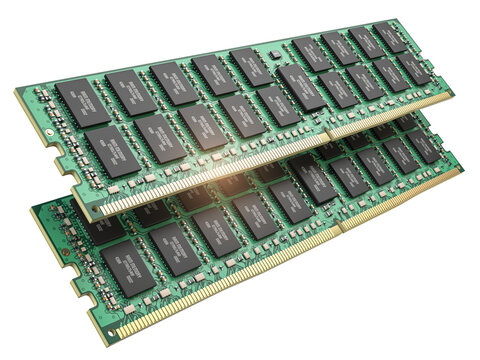

# 🖥️ PC Parts Detector


A custom-trained **YOLOv8 object detection system** that identifies PC hardware components in real time — detecting GPUs, CPUs, RAM, SSDs, and HDDs with confidence scores and component counts. Trained on a 4,000-image Kaggle dataset using transfer learning on Google Colab (T4 GPU), achieving **95.7% mAP50**. Deployed as an interactive web app via Gradio supporting both image upload and live webcam input.

🔗 **Live Demo:** [huggingface.co/spaces/ishitakaushik23/pc-parts-detector](https://huggingface.co/spaces/ishitakaushik23/pc-parts-detector)

---

## 📸 Demo

> Upload any PC hardware image or use your webcam — the model returns annotated bounding boxes, confidence scores per detection, and a component count summary.



---

## ✨ Features

- Detects **5 PC hardware classes**: GPU, CPU, RAM, SSD, HDD
- Returns **per-detection confidence scores** (e.g. RAM: 94.2%, SSD: 98.1%)
- Shows **total component count** per class
- Supports both **image upload and live webcam** input
- Real-time inference via a clean **Gradio web interface**
- Trained via **transfer learning** on YOLOv8 pretrained weights

---

## 🧪 Research Extension: Continual Learning

Beyond the deployed detector, this repo includes a **continual learning experiment** investigating catastrophic forgetting when the model is incrementally trained on new classes.

**Question:** When `trained_detector_v1.pt` is fine tuned on new, unseen classes, does it forget the original 5 classes? Can Elastic Weight Consolidation (EWC) reduce that forgetting compared to naive fine tuning?

**Setup:** Fine tuned the base model on a 2-class dataset (adapter, barcode) using two strategies — naive fine tuning vs EWC fine tuning with a Fisher Information Matrix penalty on backbone weights.

**Key finding:** EWC fine tuning achieved **identical new-class performance** (74.9% mAP50) to naive fine tuning, showing the EWC penalty did not bottleneck new-class learning while theoretically protecting weights important to the original task.

Full writeup, results table, and both fine tuned models are in [`research/`](research/RESULTS.md).

---

## 🧠 How It Works

### Model
- **Architecture:** YOLOv8 (Ultralytics) — single-stage detector that predicts bounding boxes and class probabilities in one forward pass
- **Training method:** Transfer learning from YOLOv8 pretrained weights, fine-tuned on a custom PC hardware dataset
- **Dataset:** 4,000 images across 5 classes sourced from Kaggle, trained on Google Colab with T4 GPU
- **Classes:** `GPU` `CPU` `RAM` `SSD` `HDD`

### Pipeline
```
Input (Image or Webcam)
        ↓
YOLOv8 Inference (trained_detector_v1.pt)
        ↓
Bounding Box Extraction + Class Labels + Confidence Scores
        ↓
Component count aggregation per class
        ↓
Gradio UI → annotated image + structured analysis panel
```

### Why YOLOv8?
YOLO (You Only Look Once) processes the entire image in a single forward pass rather than proposing regions first, making it significantly faster than two-stage detectors like Faster R-CNN — ideal for real-time hardware detection.

---

## 📊 Results

| Metric | Value |
|--------|-------|
| mAP50 (base model) | **95.7%** |
| RAM confidence (sample) | 94.2% |
| SSD confidence (sample) | 98.1% |
| HDD confidence (sample) | 91.5% |
| Dataset size | 4,000 images |
| Classes | 5 (GPU, CPU, RAM, SSD, HDD) |
| Training hardware | Google Colab T4 GPU |

See [`research/RESULTS.md`](research/RESULTS.md) for continual learning experiment results.

---

## 📁 Project Structure

```
pc-parts-detector/
│
├── gradio_app.py              # Gradio web app (upload + webcam)
├── trained_detector_v1.pt     # Trained YOLOv8 model weights (base)
│
├── research/
│   ├── RESULTS.md             # Continual learning experiment writeup
│   ├── naive_finetune.pt      # Naive fine tuned model (new classes)
│   └── ewc_finetune.pt        # EWC fine tuned model (new classes)
│
├── data/
│   └── data.yaml              # Dataset config (classes, paths)
│
├── assets/
│   └── demo.png               # Demo screenshot for README
│
├── requirements.txt
└── README.md
```

---

## ⚙️ Setup & Installation

### 1. Clone the repo
```bash
git clone https://github.com/ishitakaushik23/pc-parts-detector.git
cd pc-parts-detector
```

### 2. Install dependencies
```bash
pip install -r requirements.txt
```

### 3. Run the Gradio app
```bash
python gradio_app.py
```
Then open `http://127.0.0.1:7860` in your browser.

---

## 📦 Requirements

```
ultralytics
gradio
opencv-python
torch
torchvision
```

---

## 🏋️ Training

Trained using Ultralytics YOLOv8 via transfer learning on Google Colab (T4 GPU):

```python
from ultralytics import YOLO

model = YOLO("yolov8n.pt")   # pretrained base weights
model.train(
    data="data/data.yaml",
    epochs=50,
    imgsz=640,
    batch=16,
)
```

Dataset annotations are in **YOLO format** — each image has a corresponding `.txt` file with normalized bounding box coordinates and class IDs.

---

## 🖥️ App Code

```python
from ultralytics import YOLO
import gradio as gr

model = YOLO("trained_detector_v1.pt")

def detect(image):
    results = model(image)
    annotated = results[0].plot()

    detections = []
    counts = {}

    for box in results[0].boxes:
        cls = int(box.cls[0])
        conf = float(box.conf[0])
        name = model.names[cls]
        detections.append(f"{name:<10} {conf:.2%}")
        counts[name] = counts.get(name, 0) + 1

    summary = "Detected Components\n─────────────────\n\n"
    if detections:
        summary += "\n".join(detections)
        summary += "\n\nTotal Count\n"
        for k, v in counts.items():
            summary += f"\n{k}: {v}"
    else:
        summary += "No components detected"

    return annotated, summary

app = gr.Interface(
    fn=detect,
    inputs=gr.Image(type="numpy", sources=["upload", "webcam"]),
    outputs=[
        gr.Image(label="Detection Result"),
        gr.Textbox(label="Analysis", lines=12)
    ],
    title="PC Hardware Detection System",
    description="Detect computer hardware components using a custom-trained YOLOv8 model."
)

app.launch()
```

---

## 🛠️ Tech Stack

| Tool | Purpose |
|------|---------|
| YOLOv8 (Ultralytics) | Object detection model |
| Transfer Learning | Fine-tuning on custom dataset |
| Elastic Weight Consolidation | Continual learning experiment |
| Google Colab T4 GPU | Model training |
| OpenCV | Image preprocessing |
| Gradio | Web app + webcam deployment |
| Python 3.10+ | Core language |
| Hugging Face Spaces | Cloud hosting |

---

## 👩‍💻 Author

**Ishita Kaushik**  
B.Tech Mathematics and Computing, IIT Jammu  
[LinkedIn](https://www.linkedin.com/in/ishita-kaushik-b391a8361/) • [GitHub](https://github.com/ishitakaushik23)
